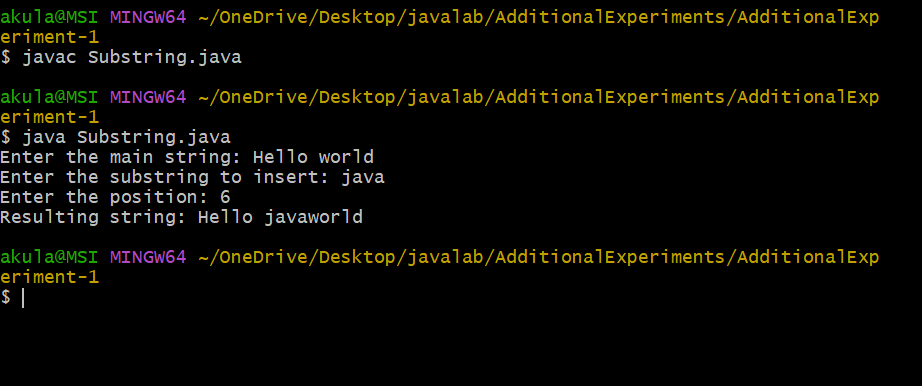
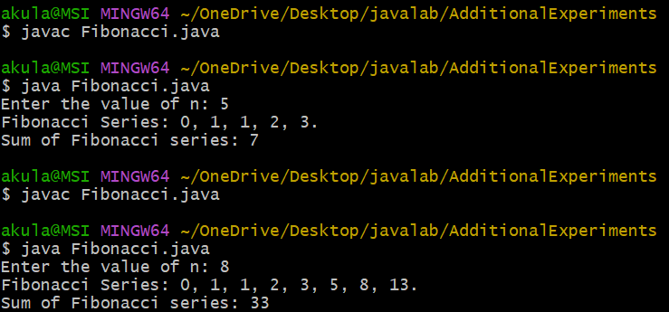
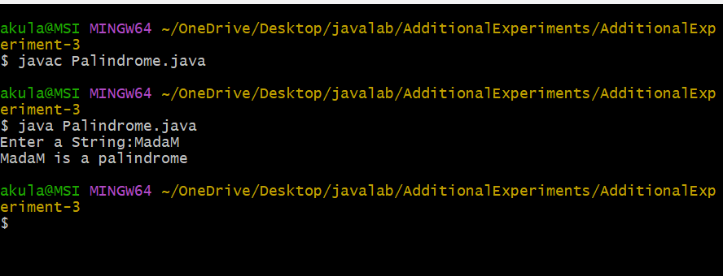
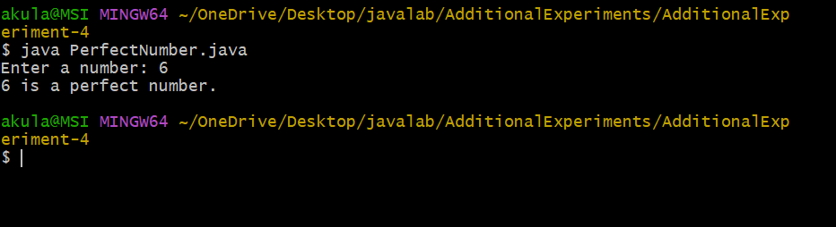

## 1:
## title:SubString
```java
import java.util.Scanner;
class Substring {
public static void main(String[] args) {
Scanner sc = new Scanner(System.in);
System.out.print("Enter the main string: ");
String mainString = sc.nextLine();
System.out.print("Enter the substring to insert: ");
String subString = sc.nextLine();
System.out.print("Enter the position: ");
int position = sc.nextInt();
if (position >= 0 && position <= mainString.length()) {
String firstPart = mainString.substring(0, position);
String secondPart = mainString.substring(position);
String resultString = firstPart + subString + secondPart;
System.out.println("Resulting string: " + resultString);
}
else {
System.out.println("Invalid position");
}
}
}
```
## output:





## 2:
## title:Fibonacci series


```java
import java.util.Scanner;
class Fibonacci{
int n,firstNumber,secondNumber,thirdNumber,sum;
Fibonacci(int number)
{
n=number;
firstNumber=0;
secondNumber=1;
thirdNumber=0;
sum=0;
}
void generate(){
System.out.print("Fibonacci Series: ");
while(n>0){
sum+=firstNumber;
if(n==1)
System.out.print(firstNumber+".");
else
System.out.print(firstNumber+", ");
thirdNumber=firstNumber+secondNumber;
firstNumber=secondNumber;
secondNumber=thirdNumber;
n--;
}
System.out.println("\nSum of Fibonacci series: "+sum);
}
public static void main(String[] args){
Scanner sc=new Scanner(System.in);
System.out.print("Enter the value of n: ");
int number=sc.nextInt();
Fibonacci f=new Fibonacci(number);
f.generate();
}
}

```

## Output:




## 3:
## title:Palindrome:

```java
import java.util.Scanner;
class Palindrome {
public static void main(String[] args) {
Scanner sc = new Scanner(System.in);
System.out.print("Enter a String:");
String str= sc.nextLine();
int start = 0;
int end = str.length() - 1;
while (start < end) {
if (str.charAt(start) != str.charAt(end)) {
System.out.println(str+" is not a palindrome");
return;
}
start++;
end--;
}
System.out.println(str+" is a palindrome");
}
}
```

## output:



## 4:
## title:Perfect Number:
```java
import java.util.Scanner;
class PerfectNumber {
public static void main(String[] args) {
Scanner sc = new Scanner(System.in);
System.out.print("Enter a number: ");
int num = sc.nextInt();
int sum = 0;
for (int i = 1; i < num; i++) {
if (num % i == 0) {
sum += i;
}
}
if (sum == num)
System.out.println(num + "num is a perfect number.");
else
System.out.println(num + "num is not a perfect number.");
}
}
```

## output:



