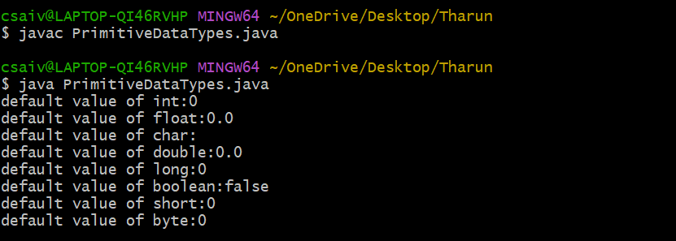
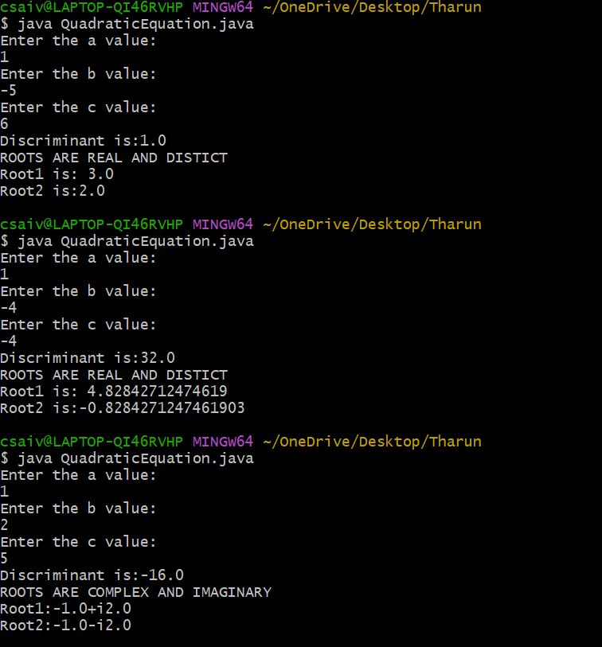
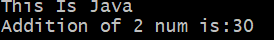
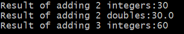
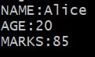

# JAVA-LAB
## Experiment1a:
## Title:Primitive data types
```java
class PrimitiveDataTypes{
  byte b;
  int i;
  float f;
  char c;
  double d;
  long l;
  boolean bool;
  short s;
public static void main(String[] args){
  PrimitiveDataTypes obj = new PrimitiveDataTypes();
  System.out.println("default value of int:"+obj.i);
  System.out.println("default value of float:"+obj.f);
  System.out.println("default value of char:"+obj.c);
  System.out.println("default value of double:"+obj.d);
  System.out.println("default value of long:"+obj.l);
  System.out.println("default value of boolean:"+obj.bool);
  System.out.println("default value of short:"+obj.s);
  System.out.println("default value of byte:"+obj.b);
  }
}

```

## OUTPUT:




## Experiment1b:
## Title:Quadratic equation
```java
import java.util.Scanner;
class QuadraticEquation{
  public static void main(String[] args){
    double a,b,c,D;
    Scanner input=new Scanner(System.in);
    System.out.println("Enter the a value:");
    a=input.nextDouble();
    System.out.println("Enter the b value:");
    b=input.nextDouble();
    System.out.println("Enter the c value:");
    c=input.nextDouble();
    D=b*b-4*a*c;
    System.out.println("Discriminant is:"+D);
    if(D>0){
      System.out.println("ROOTS ARE REAL AND DISTICT");
      double root1=(-b+Math.sqrt(D))/(2*a);
      double root2=(-b-Math.sqrt(D))/(2*a);
      System.out.println("Root1 is: "+root1);
      System.out.println("Root2 is:"+root2);
      }
    else if(D==0){
      double root=-b/2*a;
      System.out.println("ROOTS ARE REAL AND EQUAL");
      System.out.println("ROOT IS:"+root);
    }
    else {
      System.out.println("ROOTS ARE COMPLEX AND IMAGINARY");
      double real=-b/2*a;
      double img=(Math.sqrt(-D))/2*a;
      System.out.println("Root1:"+real+"+i"+img);
      System.out.println("Root2:"+real+"-i"+img);
    }
  input.close();
  }
}

```
## OUTPUT:




## Experiment2a:

## Title:Myclass

```java
class MyClass{
void display(){
System.out.println("This Is Java");
}
int calculation(int a,int b){
return a+b;
}
public static void  main(String[] args){
MyClass obj = new MyClass();
obj.display();
int result = obj.calculation(10,20);
System.out.println("Addition of 2 num is:"+result);
}
}

```
## OUTPUT:





## Experiment2b:

## Title:OverloadExample


```java
class OverloadExample{
int add(int a, int b){
return a+b;
}
double add(double a,double b){
return a+b;
}
int add(int a, int b, int c){
return a+b+c;
}
public static void main(String[] args){
OverloadExample obj = new OverloadExample();
System.out.println("Result of adding 2 integers:"+obj.add(10,20));
System.out.println("Result of adding 2 doubles:"+obj.add(10.0,20.0));
System.out.println("Result of adding 3 integers:"+obj.add(10,20,30));
}
}

```

## OUTPUT:





## Experimnet2c:
## Title:Constructor


```java
class Student{
String name;
int age;
int marks;
Student(String s,int a, int m){
name = s;
age = a;
marks = m;
}
void display(){
System.out.println("NAME:"+name);
System.out.println("AGE:"+age);
System.out.println("MARKS:"+marks);
}
public static void main(String[] args){
Student s1 = new Student("Alice",20,85);
s1.display();
}
}
```


## OUTPUT:



