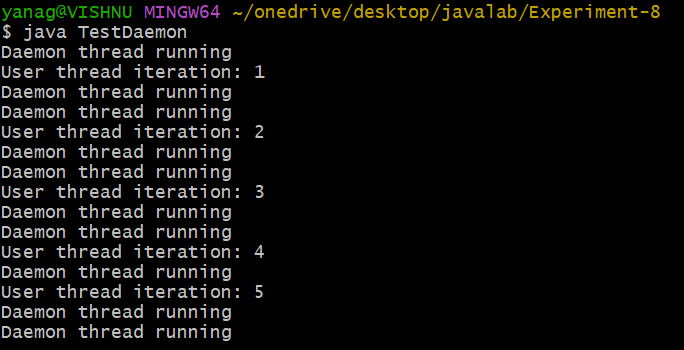
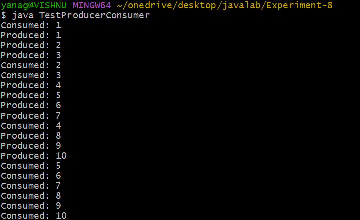
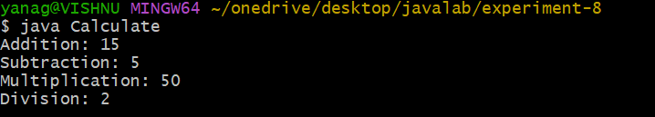

## 8A:
## Title: DAEMON THREADS

```java


class DaemonThread extends Thread {
    public void run() {
        while (true) {
            System.out.println("Daemon thread running");
            try {
                Thread.sleep(500);
            } catch (InterruptedException e) {
            }
        }
    }
}

class UserThread extends Thread {
    public void run() {
        for (int i = 1; i <= 5; i++) {
            System.out.println("User thread iteration: " + i);
            try {
                Thread.sleep(1000);
            } catch (InterruptedException e) {
            }
        }
    }
}

public class TestDaemon {
    public static void main(String[] args) {
        UserThread userThread = new UserThread();
        DaemonThread daemonThread = new DaemonThread();
        daemonThread.setDaemon(true);
        userThread.start();
        daemonThread.start();
    }
}
```

## Output:





## 8B:
## tilte:PRODUCER AND CONSUMER PROBLEM:
```java
class Buffer {
    private int[] buffer;
    private int count = 0;
    private int in = 0;
    private int out = 0;

    Buffer(int size) {
        buffer = new int[size];
    }

    public synchronized void produce(int item) throws InterruptedException {
        while (count == buffer.length) {
            wait();
        }
        buffer[in] = item;
        in = (in + 1) % buffer.length;
        count++;
        notify();
    }

    public synchronized int consume() throws InterruptedException {
        while (count == 0) {
            wait();
        }
        int item = buffer[out];
        out = (out + 1) % buffer.length;
        count--;
        notify();
        return item;
    }
}

class Producer extends Thread {
    private Buffer buffer;
    private int N;

    Producer(Buffer buffer, int N) {
        this.buffer = buffer;
        this.N = N;
    }

    public void run() {
        for (int i = 1; i <= N; i++) {
            try {
                buffer.produce(i);
                System.out.println("Produced: " + i);
            } catch (InterruptedException e) {
            }
        }
    }
}

class Consumer extends Thread {
    private Buffer buffer;
    private int N;

    Consumer(Buffer buffer, int N) {
        this.buffer = buffer;
        this.N = N;
    }

    public void run() {
        for (int i = 1; i <= N; i++) {
            try {
                int item = buffer.consume();
                System.out.println("Consumed: " + item);
            } catch (InterruptedException e) {
            }
        }
    }
}

public class TestProducerConsumer {
    public static void main(String[] args) {
        Buffer buffer = new Buffer(5);
        Producer p = new Producer(buffer, 10);
        Consumer c = new Consumer(buffer, 10);
        p.start();
        c.start();
    }
}
```

## Output:





## 8c:
## title: USER DEFINED PACKAGE:
```java
ArithmeticOperations.java


package arithmetic;

public class ArithmeticOperations {
    public int addition(int x, int y) {
        return x + y;
    }

    public int subtraction(int x, int y) {
        return x - y;
    }

    public int multiplication(int x, int y) {
        return x * y;
    }

    public int division(int x, int y) {
        return x / y;
    }
}


Calculate.java


import arithmetic.*;

public class Calculate {
    public static void main(String[] args) {
        ArithmeticOperations ao = new ArithmeticOperations();

        int sum = ao.addition(10, 5);
        System.out.println("Addition: " + sum);

        int diff = ao.subtraction(10, 5);
        System.out.println("Subtraction: " + diff);

        int prod = ao.multiplication(10, 5);
        System.out.println("Multiplication: " + prod);

        int quot = ao.division(10, 5);
        System.out.println("Division: " + quot);
    }
}
```

## Output:



